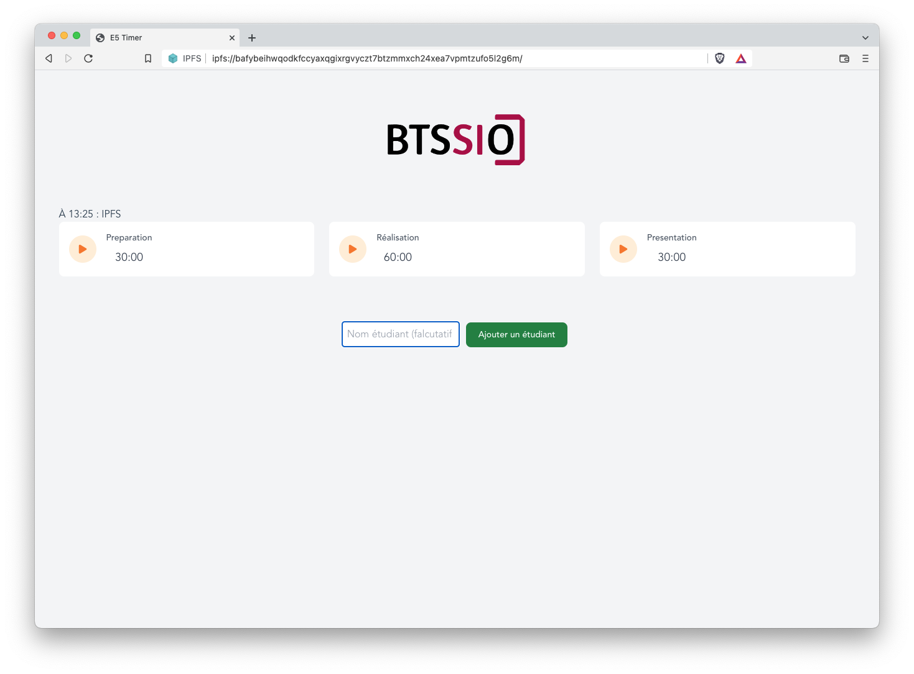

# Vue 3 : Timer épreuve E5

- Disponible à l'adresse suivante : <https://sio-e5-timer.netlify.app/>
- Disponible en IPFS : <https://ipfs.fleek.co/ipfs/QmevwKppHAGBfdVQLmTRvm8A3XBdoqCCwYjABz6wCcVu6J>
- Hash IPFS : [ipfs://QmevwKppHAGBfdVQLmTRvm8A3XBdoqCCwYjABz6wCcVu6J](ipfs://QmevwKppHAGBfdVQLmTRvm8A3XBdoqCCwYjABz6wCcVu6J)

IPFS disponible par Brave :

